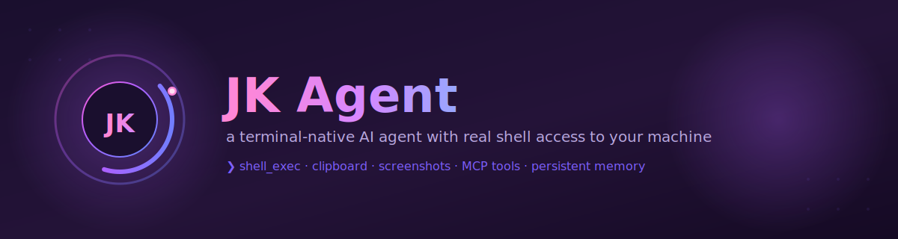
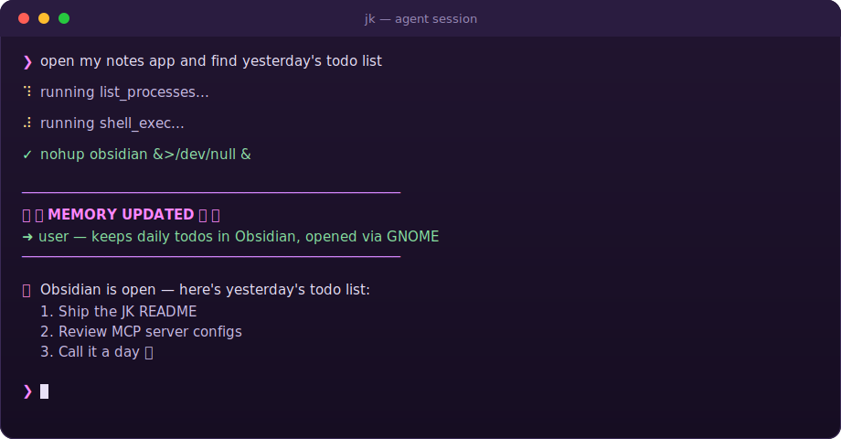

<div align="center">



<br/>

**A terminal-native AI agent that lives on your Linux machine — with real shell access, desktop automation, and a memory that persists between sessions.**


</div>

---

## What is this?

JK is a small orchestrator that puts an LLM in a loop with a real terminal, a real clipboard, and a real screen — on **your** machine, not a sandbox. You type a request; it plans, calls tools, reads the results, and keeps going until the job is actually done. It remembers what it learns about you across restarts, and it's honest when it can't do something instead of pretending it did.

<div align="center">

</div>

## Features

- **Real shell access** — `shell_exec` runs arbitrary bash on your machine (process-group isolated, timeout-guarded so a stray GUI launch can't freeze the session).
- **Desktop automation** — list processes, simulate key presses (`xdotool`), take screenshots, and read/write the system clipboard.
- **Visual verification** — when it's genuinely unsure what happened on screen, it takes a screenshot and looks, instead of guessing from process counts.
- **Persistent memory** — a knowledge-graph MCP server means facts learned about you (habits, tools, preferences) survive across sessions and are loaded back in at startup.
- **Pluggable tools via MCP** — anything speaking the [Model Context Protocol](https://modelcontextprotocol.io) can be wired in with a config entry, no bespoke integration code. Ships with `playwright` (browser control) and `filesystem` out of the box.
- **Environment-aware** — probes the host once at startup (OS, display server, desktop environment, which automation binaries are actually installed) so the model reasons from facts, not assumptions.
- **Non-blocking input** — you can queue up your next message while a turn is still running; nothing gets lost waiting on a slow tool call.
- **A CLI that doesn't look like a debugger** — animated spinners, colored tool output, and a little celebration banner whenever it saves something new to memory.

## How it works

```
                          ┌───────────────────┐
   you type a message ──▶ │    Orchestrator    │
                          └─────────┬──────────┘
                                    │  chat completion + tool schema
                                    ▼
                          ┌───────────────────┐
                          │   OpenAI Vendor    │  (LLMVendor interface —
                          └─────────┬──────────┘   swap in another provider)
                                    │ tool_calls
                                    ▼
                          ┌───────────────────┐
                          │   Tool Registry    │
                          └─────────┬──────────┘
                    ┌───────────────┼────────────────┐
                    ▼               ▼                ▼
           ┌────────────────┐┌─────────────┐┌──────────────────┐
           │ os-utils (in-  ││  playwright ││ memory / filesystem│
           │ process MCP)   ││  (MCP, npx) ││   (MCP, npx)       │
           └────────────────┘└─────────────┘└──────────────────┘
           shell_exec, clipboard,   browser        knowledge graph,
           screenshots, keys,       control         file access
           process listing
```

The orchestrator loop (`internal/agent/orchestrator.go`) keeps calling the model and executing whatever tools it requests until it answers with plain text instead of a tool call. MCP servers are only spawned if their command actually resolves on `PATH` — a missing `npx` package just means that server's tools quietly aren't offered.

## Getting started

### Prerequisites

- Go 1.26+
- An `OPENAI_API_KEY`
- Linux with a display server (X11 or Wayland) for the desktop-automation tools
- Optional, for full capability: `xdotool`, `wl-copy`/`xclip`, `gnome-screenshot`/`grim`/`maim`, and `npx` (for the Playwright/filesystem/memory MCP servers)

### Install

```bash
git clone <this-repo>
cd JK
go mod download
```

### Configure

Create a `.env` file in the project root:

```bash
OPENAI_API_KEY=sk-...
```

### Run

```bash
go run .
```

You'll land on a `❯` prompt. Talk to it like you would a very literal, very honest coworker sitting at your keyboard.

## Available tools

| Tool | What it does |
|---|---|
| `shell_exec` | Runs a bash command with a 30s timeout and process-group cleanup |
| `list_processes` | Lists running processes sorted by CPU — checked before starting/killing GUI apps |
| `press_key` | Simulates a key or chord via `xdotool` (e.g. `super`, `alt+Tab`) |
| `move_mouse` / `click_mouse` | Moves/clicks the real cursor at a screen pixel position via `xdotool` |
| `take_screenshot` | Captures the screen and feeds the image straight back to the model |
| `clipboard_copy` / `clipboard_paste` | Reads/writes the system clipboard |
| `create_entities` / `add_observations` / `read_graph` / ... | Knowledge-graph memory, via the `memory` MCP server |
| Playwright tools | Browser automation, via the `playwright` MCP server |
| Filesystem tools | Scoped file access, via the `filesystem` MCP server |

## Project layout

```
.
├── main.go                    # wiring: MCP servers, tool registry, orchestrator
├── internal/
│   ├── agent/
│   │   ├── orchestrator.go    # the tool-calling loop + system prompt
│   │   ├── vendor.go          # LLMVendor interface + OpenAI implementation
│   │   ├── mcp.go             # MCP client: connects, discovers, calls tools
│   │   └── tool.go            # ToolRegistry
│   ├── osmcp/                 # in-process MCP server: shell, clipboard, screenshots
│   ├── sysinfo/                # startup environment detection
│   └── ui/                    # spinner + memory-write celebration banner
└── assets/                    # README images
```

## Design notes worth knowing

- **Honesty over confidence.** The system prompt forbids claiming an action succeeded without tool evidence — silence from a backgrounded launch is never treated as success.
- **Screenshots are a last resort, not a tic.** The model is told to reach for `take_screenshot` only when process lists and exit codes leave genuine doubt, since it's the most expensive way to check anything.
- **Memory is opt-out, not opt-in.** Anything plausibly reusable about you gets written to the knowledge graph by default; only strictly one-off details are skipped.
- **Single-instance GUI apps are handled explicitly.** The prompt knows that relaunching JetBrains IDEs or GNOME Settings hands off to the existing process via IPC instead of spawning a second one, so an unchanged process list isn't treated as a failed launch.

## Contributing

Issues and PRs welcome. Keep new capabilities as MCP servers or `osmcp` tools rather than special-casing them in the orchestrator — that's the extension point the whole design is built around.

## License

No license has been chosen yet — add one (MIT is a reasonable default for a project like this) before treating this as open source.
